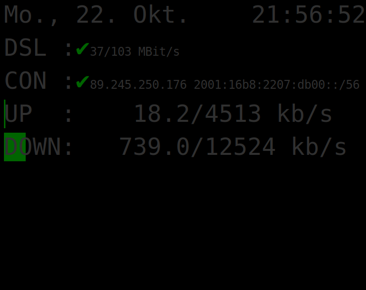

# upnp status site for Fritz!Box
[](https://codeclimate.com/github/Monschichi/upnp/maintainability)
[](https://pyup.io/repos/github/Monschichi/upnp/)
[](https://pyup.io/repos/github/Monschichi/upnp/)

Designed for 7" Raspberry Pi Display.

## Screenshot


## setup
```commandline
# optional Python venv
$ python3 -m venv .venv
$ . .venv/bin/activate
  
$ pip install -r requirements.txt
```
## run
```python
$ python upnp.py
```